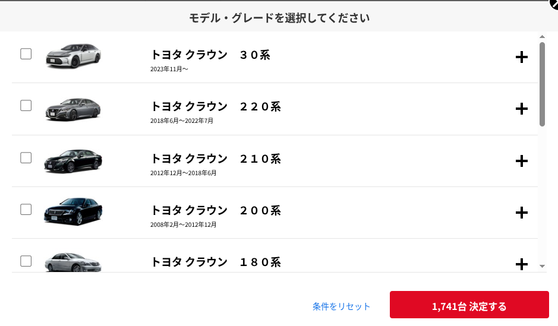

+++
title = "私的中古車購入マニュアル"
date = "2025-10-23"
+++

## 概要
知人に中古車購入時に気をつけることを教えてくれ、と頼まれ、中古車選びから成約までの注意点を簡単にまとめたことがありました。
そのとき書いた内容を公開できるように焼き直した記事になります。

## 前提
この記事は

- 自分・友人・家族のための合計5台の中古車購入を手伝ったことが（一応）ある
  - すべて国産車
  - すべて中古車
- 年式は最大20年落ち程度
- 個人車両保有歴は4年程度

という人間が書いています。
内容の保証は特にありませんので、参考程度にお読みいただければ……。

## 車種のおすすめ

好きなクルマを買おう！で終わってしまう話なのですが、無理やり広げると……

特にこだわりがないのであれば、一般的に不人気と言われる車種を選んだほうが相対的に良い個体を引く確率が上がる気がします。
今明らかに不人気なのはセダン、特にそれほどブランド力が高くない車種（クラウンとかスカイラインとかそういうものではない）だと思います。

SUVやミニバンは人気カテゴリなので中古車でも割高な印象はあります。
コンパクトカーはどうか？となりますが、確かにお手頃な値段が多いのですが、その分荒い（メンテが雑）使われ方をした個体も多そう。

本当に誰も乗ってなさそうな、明らかに高年齢層向けな野暮ったいセダン みたいな車種はお買い得です。

ちなみに自分が乗っているのは ホンダ・インテグラ TypeR （DC5型, 2001年式）というスポーツクーペですが、
このカテゴリの中ではなぜか不人気寄りで、同等のスペックの割にかなりお手頃な値段でした。なんでだろうね。
（最近国産スポーツカー全般上がってるおかげで。引っ張られて値上がりしているっぽい)

## 認定中古車をチェックする

候補となる車種が決まった。中古車を探してみよう。となったとき、「中古車」で検索して出てくるのは、goo-net や car-sensor などのポータルサイトですね。

このあたりのサイトを見る前に「認定中古車」をチェックするといいかもしれません。

認定中古車とは、カーディーラーが下取りした車両のうち、比較的状態のいいものを丁寧に整備してディーラーで再販売しているもので、いわば公式お墨付きの中古車です。
Apple とかがやっている 「整備済製品」に似ています。
当然一般の中古車より値段は上がるのですが、ものによっては保証がついていたりして、あまりリスクを負いたくない人にはおすすめです。

認定中古車は高すぎて手が出ないという場合でも、どのような状態の個体でいくらくらいという相場感を掴むことができます。
たいていのメーカーは専用の認定中古車サイトがあり、車種ごとに検索可能です。

## 中古車サイトでの検索

つづいて中古車サイトを検索するときの注意点です。

### 年式とモデルチェンジについて

新規リリースされた車種でない限り、たいていの車種は同じ名前で仕様変更を繰り返しています。
この改良のうち仕様変更が大きい（正確には型式が変わる）ものをフルモデルチェンジといい、中古車サイトでも明確に区切られています。

以下の画像はトヨタ・クラウンのモデルリストです。
「30系」「220系」などと区切られているものがフルモデルチェンジが行われたタイミングです。

モデルライフが長い場合、フルモデルチェンジまではいかないけど、それなりに手を加えた改良を何回か行うことがあり、これをマイナーチェンジといいます。

上図でいうと、220系クラウンは発売から2年後に1度マイナーチェンジを行っており、これより前の年式の個体を**前期型**、これより後の年式の個体を**後期型**と呼んでいます。
車種によっては前期型・中期型・後期型 と3段階に分かれていることもあります。

つまり、同じモデルの中でもマイナーチェンジによってかなり機能や仕様が変わっていることがあります。
欲しい車種のマイナーチェンジ履歴と仕様を調べ、どの年式の個体が良いか絞っておくことをオススメします。

一般的には高年式で改良が進んだ後期型のほうが人気ですが、車種によっては前期型のほうが高値になっている場合も。（後期でデザインに大幅変更が入ったなど）

### グレードについて

クルマには個体ごとの仕様差として、「グレード」という概念があります。
簡単に言えば各個体のエンジン・パーツやオプションパーツなどが異なっています。

新車で購入するなら好きなグレードを選んで好きなようにオプションをつければいいのですが、中古車はすでにあるものから選ぶので注意が必要になります。

新車販売時のカタログや、価格.com のスペック表などを見て、自分がほしい仕様が満たされているグレードを選ぶ必要があります。
ベースグレードと呼ばれる、装備の薄いグレードが安いのですが、あとから交換できないパーツもあり、自分の好みとのトレードオフとなります。

いわゆるメーカーオプションと呼ばれる、出荷時に工場で組み込まれるパーツについては、その装備がついたグレードでないと後付が難しいです。
逆にディーラーオプションと呼ばれる、（新車の）納車前にディーラーで取り付けられるタイプのパーツ（カーナビやオーディオ関連など）は、部品さえ手に入れば後からでもなんとかなるかも。

ちなみに、個人的には大衆車なら多少高くてもスポーツグレード（ちょっと走行性能に振ったパーツとかがついているグレード）を選ぶようにしていました。
これは「新車でわざわざスポーツグレードを選ぶような人は、こだわりがあって、丁寧にメンテナンスして乗ってきただろう」という勝手な思い込みによるものです。

### 中古車検索

検索の際、私が調べるときは以下のような基準で絞っていました。
ただここは個人の価値観によるところが多いので参考程度でお願いします。

ちなみに中古車ポータルサイトは goo-net / car-sensor 両方をウォッチしておくことがオススメです。たいてい両方に登録されていますが、たまに片方にしかない個体があります。

- 走行距離
  - 20年以内の国産車であれば、よほどの過走行車（目安としては20万km Over）でなければ特に気にしませんでした。
  - 逆に年式の割に過少な走行距離の個体のほうが、長年放置のリスクがありそう。
- 修復歴
  - いわゆる事故歴というやつで、骨格にダメージが入るような事故を経験した個体が歴ありとなります
  - どのような事故を経験していて、現在走行に影響あるかどうか素人では判断できないので自分では避けがちです
    - 詳細をしっかり説明されて、リスクを承知で買うならありかも。。
- 記録簿
  - 車検や点検の記録が残っているかどうか
  - これがあるから優良個体とは言い切れないですが、少なくともそれなりにメンテされてきたということはわかるので判断材料としてはアリです
- ワンオーナー
  - ついているとラッキー、くらい？
  - あんまり気にしたことがない……
- 写真
  - いろんなアングルの写真があると判断材料は増えますが、加工されていることも多いのであまり当てにしていませんでした
  - どちらかというと内装の状態に注目すべきかも

### 現車確認

気になる個体が見つかったら、実際にお店に行って現状を確認します。
個人的に、現車が遠方にあっても絶対に一度は行くべきだと思っています。中古車にはテキストや画像に現れない情報がたくさんあるからです。

Youtube などで調べると、下回りを見ろとか、エンジンオイルの状態を見ろとか、色々細かいテクニックが紹介されています。
が、ぶっちゃけ素人がそういうところを見ても全然判断がつかない（＆業者はプロなので高度に偽装できます）。

そのため、私は素人でも判断しやすい「**このクルマがどう使われてきたか**」というポイントに絞ることをオススメします。
より具体的にいうと、内外装の状態・前オーナーの情報・メンテナンスの履歴 といった部分です。

- 内外装の状態
  - どんなにきれいに清掃されていても、使われ方によってクセが出る部分です。
    - 後部座席がきれいなら、子どものいない人だったのかな、とか
    - トランクの摩耗が激しそうなら、荷物をたくさん積んでいたのかな、とか
- 前オーナーの情報
  - 直接的な情報は個人情報なのでもちろん秘密ですが、お店によってはそれとなくこういう人から買い取りました、とか教えてくれる場合があります
  - 私のインテグラは相場に比べてかなり安かったのですが、その理由を聞いてみたところ
    「前オーナーが本職の整備士で、メンテナンスを自前でやっていた、状態は良さそうだけど、店としては素人が整備した扱いで売るしかないので、安めになっている」
    とのことで、それなら問題ないだろうと思って買いました
    - 結果的に今のところは致命的な故障などはしていません。
- メンテナンスの履歴
  - 「記録簿なし」になっていても、一枚もメンテ記録がありません、みたいな個体はあんまりないです
    - 逆に書類がまったくないのは要注意かも？
  - 残っている記録などを見ると、エンジンオイル交換の間隔や、消耗品交換の履歴がわかるので、そこからどう扱われてきたか推測します

現車確認ではこのあたりの情報を聞きつつ、お店の対応の様子を見るとよいかと思います。
具体的には以下のようなポイントを確認していました

- 自社で整備工場を持っているか
  - 自社工場があって、整備事業もやっているなら、それなりに納車前整備もしてくれることが多い
- 普通の接客（？）をしてくれるか
  - 中古車店の接客は概して雑がちですが、残念ながらあり得ないくらい失礼な対応をしてくる店もあります
- ネガティブな情報も出してくれるか
  - その個体のネガティブな部分を聞いてみて、ごまかさずにちゃんと教えてくれるか
  - 車種特有のウィークポイントなどを教えてくれるような、その車種に詳しいスタッフが在籍している など

### その他

契約後……の話も書こうかなと思ったのですがちょっとネタ切れというか力尽きました。。すみません。気力があれば加筆します。

個人的に納車前にハマった点としては

- 自動車保険に加入する際にナンバープレートや車検証の情報がいるので、納車前にショップから聞いておく必要がある
  - これがないと自走で帰る場合無保険運行になっちゃう
- ETC がついていない場合つけて納車してもらったほうがよい
  - これがないと自走で帰るときに高速使いづらくて面倒
- ナビがない個体の場合、なんか汎用的なスマホホルダを用意しておくとよいかも
  - これがないと自走で帰るときに（以下略）
