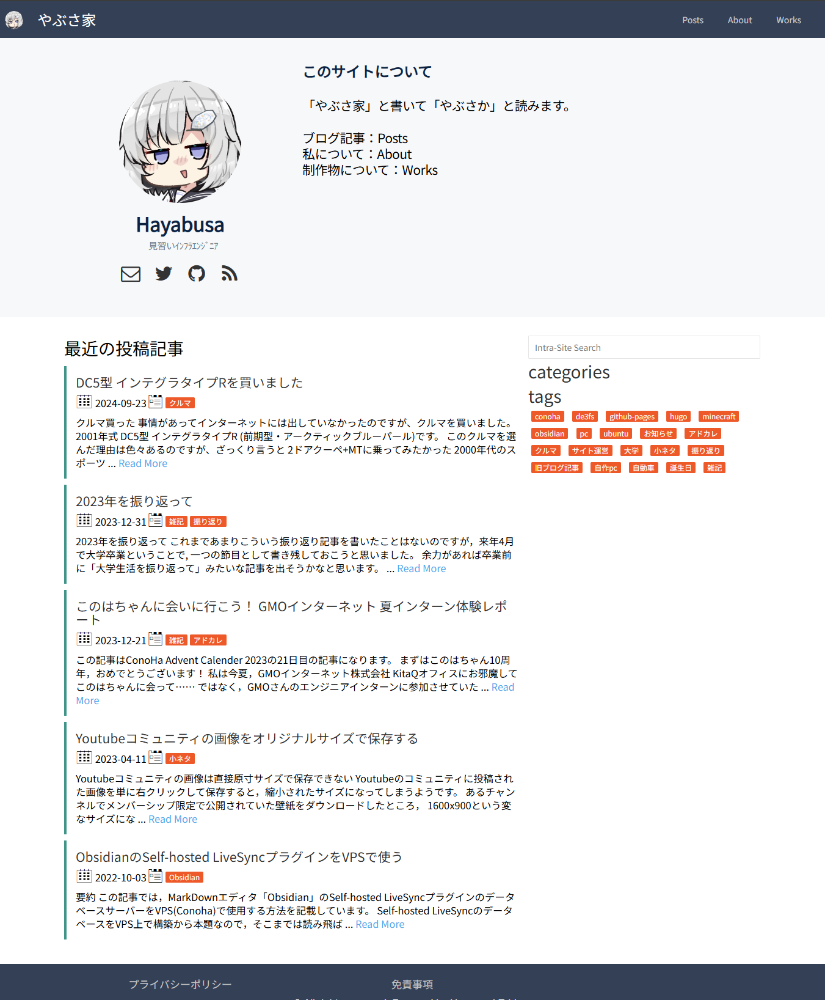

+++
title = "blog.h4y4bus4.com 開設にあたって"
description = "blog.h4y4bus4.com を作り、同時に公開していたサイト群を整理したよという話です。"
[extra]
display_published = false
toc = false
+++

blog.h4y4bus4.com を作り、同時に公開していたサイト群を整理したよという話です。

## どうして作り直したか
私が公開しているサイトとして、整理前は以下の4つがありました。

- blog.heiki-hecchara.net
    - 一番最初につくったブログで、あらゆることを書いていた。
    - Hugo + Github Pages で構築。
    - Hugo の生成がやや重たい and/or Github Pagesが不安定なときがあった
    - デザインやレイアウトが最近の好みではないかも
- zenn.dev/h4y4bus4
    - 上記のブログから分離して、技術的な内容の記事を書くために用意した Zenn のアカウント。
    - Zenn なので、当然運用はおまかせ。
- www.h4y4bus4.com
    - メインとなる個人ホームページ。
    - フルスクラッチで書いた HTML+CSS を Cloudflare Pagesで運用。
- docs.h4y4bus4.com
    - 公開範囲の限定されたコンテンツを載せていたサイト。
    - フルスクラッチで書いた自作 SSG （途中で開発打ち切り）で生成した HTML + CSS を自宅サーバの Nginx + Cloudflare Tunnel で運用。
        - Basic認証をかけたかったのでこのような構成にした。
        - が、自宅サーバの Nginx が非常に不安定で502エラー多発。

と、このような混沌とした状態になっていたので、整理することにしました。

## 整理方針
サイトの整理にあたって色々考えた結果 次のような方針をとることに。

- heiki-hecchara.net はドメインごとクローズ方向にしたい
- 今後、公開サイトは *.h4y4bus4.com に集めたい
- zenn.dev には技術的な記事のみを書き、それ以外の適当なコンテンツを置く場所がほしい
- static なコンテンツは運用が楽な仕組みにのっけたい

## サイト群の整理
この方針をもとにサイト群を以下のように整理しました。

- blog.heiki-hecchara.net
    - blog.heiki-hecchara.net はクローズ。
    - ただし、リンクしていただいているサイトがいくつかあったので、閉鎖はしない。
    - Github Pages は維持費かからないし。。
- zenn.dev/h4y4bus4
    - 技術的な記事はこれまで通りここに書く。
- www.h4y4bus4.com 
    - メインの個人ホームページとして引き続き維持する。
- docs.h4y4bus4.com
    - 維持が大変だし、限定公開の需要も薄れてきたのでさっさと閉じる。
    - 自作SSGはつらい。。
- blog.h4y4bus4.com
    - 技術的な記事以外の適当なコンテンツを公開する場所 として新設
    - blog.heiki-hecchara.net とか docs.h4y4bus4.com からできるだけコンテンツを移植する
    - 技術としては Hugo でも良かったが、別の SSG を触りたい
    - 運用は楽そうな Cloudflare Pages に載せる

## ブログをつくってみての感想
というわけで色々閉じたり作ったりしつつこのサイトができました。

SSG として [Zola](https://www.getzola.org/) を採用しました。
決めては特にありません、なんとなく軽そうでいいかなと思ったくらいです。
Rust わかんねーなーという若干の不安はあったのですが、Rust が使われてるのはコア部分だけで、フロントエンド的なカスタマイズは HTML + CSS + JS の知識だけでできました（あたりまえか）。

テーマは [anemone](https://github.com/Speyll/anemone) というものをお借りしてますが、作者の [Speyll さんのサイト](https://speyllsite.pages.dev/)がとても素敵で、一発で好きになったのですぐ採用しました。個人開発だもの、そんくらいのゆるさでちょうどいいんです。

幸いここ1年くらいお仕事でちまちまとフロントエンドを触って多少は知見が溜まってきており、困ったらカスタマイズすればいいやろのノリでやっています。
というかしている。日本語フォントを入れてカラーリングを変えたくらいだけど……。

そんなわけでほぼ勢いで作ったブログですが、ちょっとずつふるいコンテンツは移植していく予定です。
カスタマイズしたテーマは [Github リポジトリ](https://github.com/Hayabusa58/blog.h4y4bus4.com)に置いているのでご自由におつかいください。

それでは。。
<!--  -->