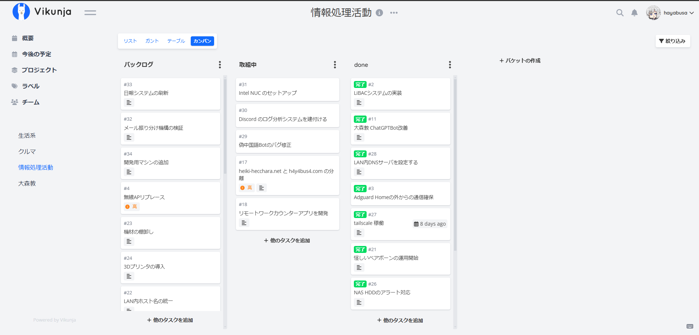
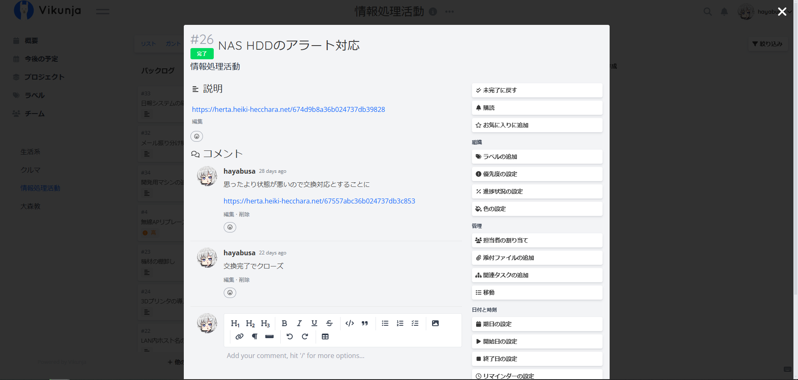

+++
title = "Vikunja によるチケット管理"
date = "2025-02-11"
+++
**⚠️この記事は旧ブログからの移行記事です。内容が古い・正確でない可能性があります。**

## はじめに
情報処理活動(開発・自宅サーバ運用・ガジェット収集など)を体系的に管理するためチケットシステムを導入したという話です。

チケットの管理には [Vikunja](https://github.com/go-vikunja/vikunja) という OSS を使用しています。
(なお Vikunjaは厳密にはチケットシステムではありません)

## Vikunja のUI
Vikunja は以下のようなインタフェースを持っています。

チケット一覧画面を開いたところ。

各チケットを開いたところ。

## Vikunja の利点
自分は一つの作業をしているときに「そういえばあれやりたいな」とか「これも作っておきたい」とか関係ないことを思いついて手が止まってしまうことがあるたちです。思いついた内容について調べたのに、メモを怠った結果、労力が無駄になることもあります。
またあれもこれもと手を出した結果、中途半端なまま忘れて立ち消えになったこともたくさんあります。

Vikunja を導入してみて、こういうときにとりあえずチケットを起票して、思いつきや調べたことを貼り付けておけばいったん脳から消し去ることができるので非常に便利。
定期的にチケット一覧を振り返るタイミングで、そういえばこれはどこまで調べたかなという状況まですぐに確認できるため、脳内メモリから消えて沙汰止みになることも防げまえす。

なおかつ、Vikunja はあくまで個人向け ToDo 管理ツールであり、十分なチケット管理機能を備えながらも、機能が多すぎて重かったり使いづらかったりすることがありません。UI もモダンでよくできています。

チケットシステムは世の中の多くの業務で案件管理などに使われているのだろうが、個人的な趣味開発であっても十分威力を発揮します。生産型の趣味を持っている方にはおすすめです。